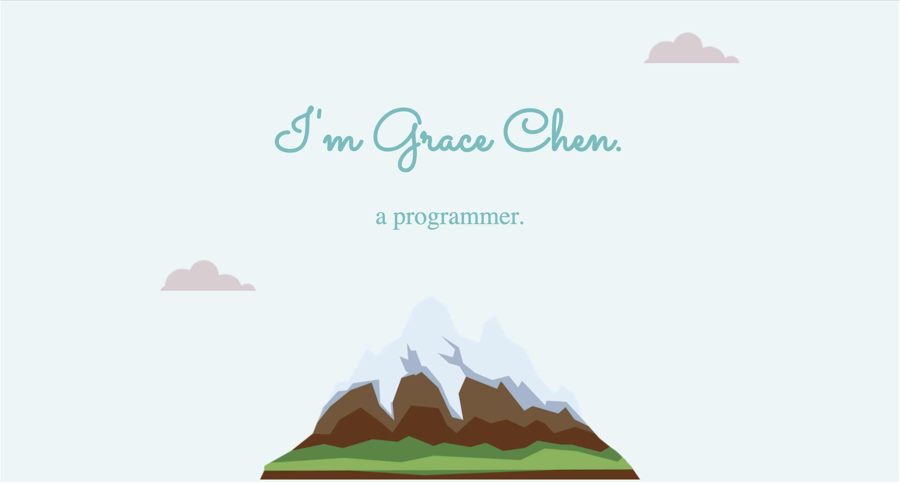

# Personal-Website - Angela Yu's Web Development Course

## Table of contents

- [Overview](#overview)
  - [Screenshot](#screenshot)
  - [Links](#links)
- [My process](#my-process)
  - [Built with](#built-with)
  - [What I learned](#what-i-learned)
  - [Continued development](#continued-development)
  - [Useful resources](#useful-resources)
- [Author](#author)

## Overview

### Screenshot

### Links

- Live Site URL: https://gracec-339.github.io/Personal-Website/

## My process

### Built with

- Semantic HTML5 markup
- CSS custom properties
- Flexbox
- CSS Grid

### What I learned

- How to build a website from scratch, more about web design
- The principle of colour pallette
- The Box Model of Website Styling
- CSS statistic and relative positioning
- Font styling
- Debug! 

### Continued development

- More practice on CSS rules
- More about how to record my process of learning web development and using Github

### Useful resources

- https://www.udemy.com/course/the-complete-web-development-bootcamp/learn/lecture/17966538#notes - This is a video Angela talked about "Nothing easy is worth doing". I felt encouraged and would love to devote more time in coding!
- https://developer.mozilla.org/en-US/docs/Web/HTML - MDN
- Toggle Pesticide - The Chrome extension which is really helpful for CSS styling

## Author

- Website - Grace Chen (https://gracec-339.github.io/Personal-Website/)
- Twitter - [@GraceC141242]https://twitter.com/GraceC141242

